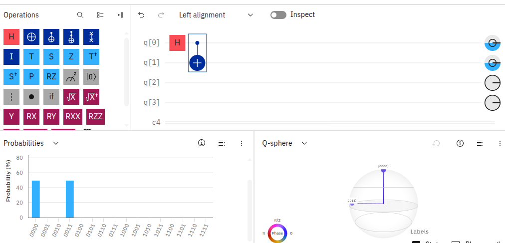

# Quantum_Fujitsu_Prep
I am deeply interested in entering the field of Quantum Computing. This repository tracks my grind preparing for my Quantum Precision research internship at Fujitsu.

# 90-Day Quantum & CSE Master Log

## 🚀 Milestone Progress
- [x] **WEEK 1: Environment Setup, Math Foundations, and Matrix Operations**
- [ ] WEEK 2: Probability, Statistics, and Noisy Simulators (Up Next)

---

## 📅 Weekly Deep Dive Journal

### 📊 Week 1 Summary: Foundational Logic & Visual Circuit Verification
* **Status:** Phase 1 Complete Ahead of Schedule

#### 🧠 What I Have Learned
1. **Core Mathematics:** Mastered vectors, matrix dimensions, dot products, and multi-qubit tensor transformations required to process quantum gates.
2. **NumPy Implementation:** Transitioned from basic coding to building manual computational states ($|0\rangle$, $|1\rangle$) and 2x2 quantum gate operators directly inside NumPy arrays.
3. **Quantum Mechanics:** Built an intuitive understanding of **Superposition** (using the Hadamard H-Gate) and **Entanglement** (using the multi-qubit CNOT gate).

#### 🛠️ Visual Circuit Verification (IBM Quantum Composer)
I successfully designed and validated a maximally entangled **Bell State ($|\Phi^+\rangle$)** using the visual drag-and-drop node interface. 

*   **The Logic Flow:** A single qubit was placed into uniform superposition using an $H$ gate, which was then coupled to a target qubit using a controlled-NOT ($CX$) gate.
*   **Circuit Architecture:** 
    

